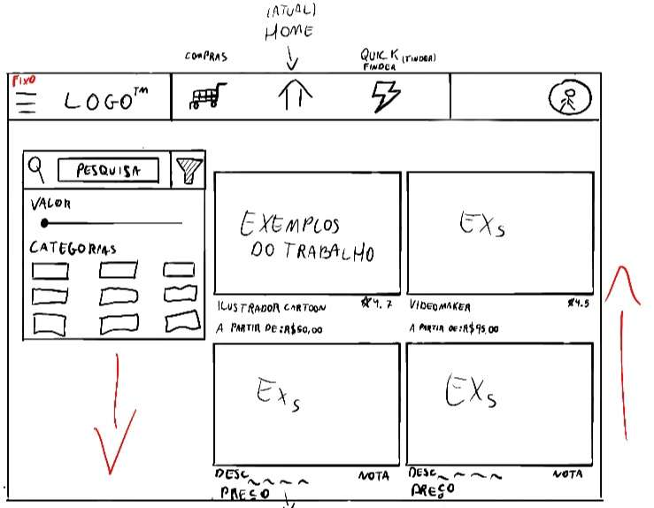
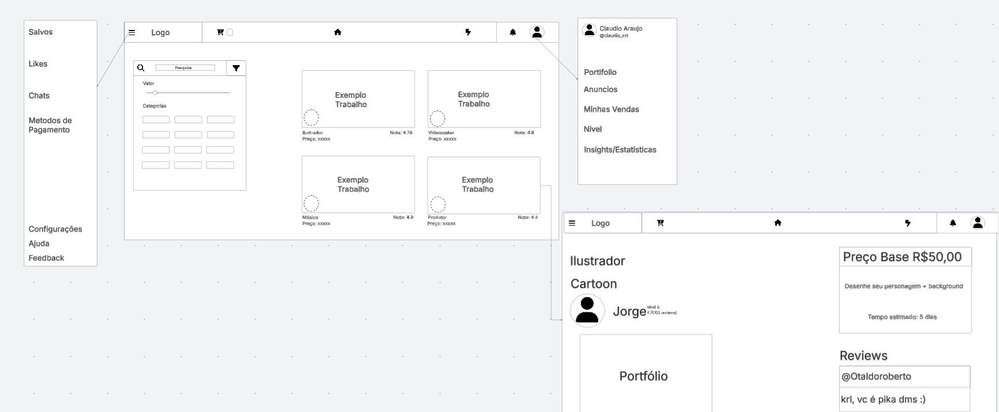

# Introdução

Informações básicas do projeto.

* **Projeto:** Art Flow
* **Repositório GitHub:** (https://github.com/Miguel-Nasciment/pbh-oficina-1-20250402.git)
* **Membros da equipe:**

  * [Antônio Oliveira Garíglio](https://github.com/antoniogariglio)
  * [Felipe dos Reis Araújo](https://github.com/FelipeReisAraujo)
  * [Gabriel Cardoso da Gama](https://github.com/biruleiii)
  * [Gustavo Henrique Silva](https://github.com/1Guhh)
  * [Miguel Andrade Nascimento](https://github.com/Miguel-Nasciment)

A documentação do projeto é estruturada da seguir
1. Introdução 
2. Contexto
3. Product Discovery
4. Product Design
5. Metodologia
6. Solução
7. Referências Bibliográficas

✅ [Documentação de Design Thinking (MIRO)](files/processo-dt.pdf)

# Contexto

Detalhes sobre o espaço de problema, os objetivos do projeto, sua justificativa e público-alvo.

## Problema

**Identificamos uma carência de um ambiente seguro onde artistas de ramos distintos tem a possibilidade de encontrar e entrar em contato com possíveis clientes, além de possibilitar formação de grupos de diversos profissionais para um trabalho conjunto .** 

## Objetivos

**Desenvolver um software que proporcione um ambiente seguro e eficiente para que artistas de diferentes ramos possam encontrar e estabelecer contato com potenciais clientes, além de facilitar a formação de grupos colaborativos entre profissionais para a realização de trabalhos conjuntos.**

Objetivos Específicos:

**Investigar e especificar os requisitos funcionais e não funcionais do software: Realizar um levantamento detalhado das necessidades dos artistas e potenciais clientes, identificando as funcionalidades essenciais para a interação, comunicação, apresentação de portfólio, busca por profissionais e formação de grupos. Isso incluirá a definição de aspectos como segurança da informação, usabilidade, desempenho e escalabilidade da plataforma.**

**Desenvolver e implementar um sistema de busca e filtragem avançado para artistas e clientes: Criar mecanismos eficientes que permitam aos clientes encontrar artistas com base em diferentes critérios (ramo artístico, estilo, experiência, localização, etc.) e aos artistas identificar oportunidades de trabalho ou colaboradores para projetos específicos, utilizando filtros detalhados e palavras-chave relevantes.**

## Justificativa

**A motivação central para o desenvolvimento desta aplicação reside na identificação clara de uma lacuna no mercado para artistas de diversas áreas. Atualmente, muitos profissionais enfrentam dificuldades significativas para divulgar seu trabalho de forma eficaz, conectar-se com clientes interessados e encontrar outros artistas para colaborações enriquecedoras. As plataformas existentes muitas vezes são genéricas, com foco em nichos específicos ou carecem de recursos que realmente atendam às necessidades multifacetadas da comunidade artística.**

## Público-Alvo

 **Artistas**

**Perfil: Profissionais de diversos ramos (visuais, performáticos, escritores, etc.). Nível de conhecimento tecnológico variado, geralmente familiarizados com plataformas de divulgação online. Principalmente autônomos ou em pequenas estruturas.**
**Necessidades: Divulgar portfólio, encontrar clientes (incluindo empresas e indivíduos) e oportunidades, conectar-se com outros artistas para colaborações.**

**Clientes Individuais:**

**Perfil: Usuários com diferentes níveis de conhecimento tecnológico buscando contratar artistas para necessidades pessoais (encomendar uma obra de arte, contratar para um evento pessoal, etc.).**
**Necessidades: Encontrar artistas que atendam às suas necessidades específicas, visualizar portfólios, comparar preços e perfis, comunicar-se de forma segura.**

**Empresas:**

**Perfil: Organizações de diversos setores (produtoras, agências, galerias, empresas em geral) com bom conhecimento tecnológico, buscando contratar artistas para projetos profissionais (design, eventos corporativos, marketing, conteúdo, etc.).**
**Necessidades: Encontrar artistas com experiência profissional, verificar portfólios e referências, solicitar orçamentos, gerenciar a comunicação e o fluxo de trabalho para contratações de maior escala ou projetos contínuos.**

# Product Discovery

## Etapa de Entendimento

**1. Matriz CSD (Certezas, Suposições, Dúvidas):**

**Certezas:**
**Existe uma demanda por plataformas que facilitem a conexão entre artistas e produtores, e clientes que buscam esses profissionais.**    
**A plataforma deve permitir a criação de perfis, busca por artistas/produtores, visualização de portfólios e contato inicial entre as partes.**    
**A interface do usuário deve ser intuitiva e agradável.**    
**A plataforma deve ser responsiva para diferentes dispositivos.**    
**A mídia (fotos, vídeos, áudios) é essencial na plataforma.**    
**Suposições:**
**Recursos premium podem gerar receita (divulgação paga, etc.).**    
**O público-alvo inclui artistas independentes, produtores e clientes interessados em serviços artísticos**   
**Filtros de busca avançados melhorarão a eficiência da plataforma.**    
**Um sistema de avaliação e feedback aumentará a confiança.**    
**Ferramentas de comunidade (fóruns) podem melhorar a interação entre os usuários.**    
**Dúvidas:**
**Qual o melhor modelo de monetização (assinaturas, comissões, publicidade)?**    
**Quais estratégias de marketing serão mais eficazes?**    
**Como a plataforma se diferenciará da concorrência?**   
**Como garantir a qualidade e segurança do conteúdo gerado pelos usuários?**    
**Quais recursos adicionais são mais valiosos (colaboração, integração com redes sociais)?**    
**Quais as legislações relevantes para a plataforma (trabalho, dados dos usuários)?**    
**2. Mapa de Stakeholders:**

**O Mapa de Stakeholders identifica os principais grupos envolvidos:**

**Fundamentais: Artistas, Produtores.**    
**Importantes: Artistas em ascensão, Produtores em geral, Casas de Show e Estúdios.**    
**Influenciadores: Influenciadores, Redes Sociais, Plataformas de Distribuição Digital, Opinião Pública, Secretaria Nacional de Direitos Autorais e Propriedade Intelectual.**    
**3. Entrevistas Qualitativas:**

**As entrevistas qualitativas com artistas revelaram os seguintes pontos:**

**Como buscam trabalho/colaborações: Redes sociais, networking.**    
**Desafios: Visibilidade, engajamento.**    
**Plataformas utilizadas: Instagram, TikTok, YouTube, Twitter, Whatsapp, Discord.**    
**Expectativas de uma plataforma: Chat seguro, qualidade de vídeo/imagem, transações seguras, algoritmo de agrupamento de conteúdo similar, hashtags/páginas/comunidades, filtros de interesse.**    
**Disposição para pagar por recursos premium: Depende da qualidade e benefícios (divulgação, exposição).**    
**Importância do portfólio online: Essencial para mostrar o trabalho e atrair clientes.**    
**Facilidade de encontrar artistas: Busca difícil atualmente, um sistema eficiente de busca é necessário.**    
**4. Highlights de Pesquisa:**

**Os "Highlights" da pesquisa apontam para:**

**Dificuldade em conseguir visibilidade e valorização do trabalho.**    
**Redes sociais são primordiais para a comunicação.**    
**Carência de um local mais profissional para a comunicação entre artistas e produtores.**    
**Necessidade de sistemas de portfólio e ações para o pós-contato entre usuários.**

## Etapa de Definição

### Personas

**João Pereira - Agente de Eventos**    

**Descrição: João é um agente de eventos de 35 anos. Ele utiliza o computador para planejar eventos, gerenciar orçamentos e se comunicar com artistas, e o celular para contatos rápidos e resolver imprevistos. Trabalha em agências de eventos, produtoras ou de forma independente. É organizado, comunicativo, negociador, dinâmico e exigente com prazos e qualidade. Seus objetivos principais são encontrar artistas talentosos para seus eventos, negociar preços e contratos de forma eficiente e gerenciar a logística e produção dos eventos. Seu sonho é produzir eventos de grande porte, reconhecidos pela qualidade e inovação.**
**Mapa de Empatia: O Mapa de Empatia de João mostra que ele precisa de uma plataforma que facilite encontrar profissionais de áreas distintas, possibilite definir orçamentos e agilize o encontro de profissionais em um só lugar. Suas dores incluem a dificuldade em montar equipes para trabalhos mais avançados e em pegar diferentes orçamentos, além do estresse na organização. A plataforma idealmente proporcionaria maior leque de profissionais, menos estresse na organização e economia de tempo e dinheiro.**

**2. Lucas Oliveira - Artista Freelancer**    

**Descrição: Lucas é um artista freelancer de 32 anos, com habilidades em escultura, arte digital e design de personagens. Ele frequenta exposições de arte, galerias, eventos de design e utiliza plataformas online de portfólio e redes sociais profissionais. É profissional, ambicioso, busca expandir sua rede de contatos, valoriza a qualidade e o reconhecimento. Seus objetivos principais são encontrar projetos desafiadores e bem remunerados, conectar-se com outros profissionais da área, divulgar seu trabalho para um público seleto e gerenciar seus contratos e pagamentos de forma eficiente. Seu sonho é construir um estúdio de arte, trabalhar em projetos de grande escala e ser reconhecido como referência em sua área.**
**Mapa de Empatia: O Mapa de Empatia de Lucas revela que ele precisa de um local onde deixar seu portfólio, ter maior visibilidade e criar networking dentro de sua área. Suas dores centrais são achar clientes e a dificuldade de pessoas de fora encontrarem seu trabalho. A plataforma deve facilitar a procura de clientela, aumentar o alcance de seu produto e proporcionar maior visibilidade.**

**3. Sofia Martins - Analista de Marketing Digital**    

**Descrição: Sofia é uma analista de marketing digital de 25 anos, com interesse em moda, viagens, podcasts e ativismo social. Ela utiliza redes sociais (Instagram, Pinterest, TikTok), frequenta eventos culturais, lojas de design e coworkings, tanto presencialmente quanto online. É independente, antenada às tendências, valoriza a autenticidade e aprecia design e estética. Seus objetivos principais são encontrar obras de arte e produtos originais para decoração, adquirir presentes exclusivos, colaborar com artistas em projetos e personalizar produtos com trabalhos de arte. Seu sonho é decorar seu apartamento com peças únicas, apoiar artistas independentes e criar um ambiente personalizado e inspirador.**
**Mapa de Empatia: O Mapa de Empatia de Sofia destaca sua necessidade de achar profissionais qualificados e um local seguro onde não haja chance de fraude. Suas dores incluem a dificuldade em achar profissionais e a preocupação com a segurança. A plataforma deve facilitar sua busca, promover profissionais qualificados e proporcionar contas de empresa e profissionais mais qualificados, além de segurança e verificação de currículos.**

# Product Design

Nesse momento, vamos transformar os insights e validações obtidos em soluções tangíveis e utilizáveis. Essa fase envolve a definição de uma proposta de valor, detalhando a prioridade de cada ideia e a consequente criação de wireframes, mockups e protótipos de alta fidelidade, que detalham a interface e a experiência do usuário.

## Histórias de Usuários

**Artista visual**
**Como Artista visual, Eu preciso de criar um portfólio online com minhas melhores obras, Para que agências de publicidade e clientes interessados em ilustração possam avaliar meu estilo e qualidade.**

**Como Músico freelancer, Eu preciso de especificar minha disponibilidade e minhas tarifas por tipo de serviço (shows, gravações, aulas), Para que produtores e clientes saibam se posso atender às suas necessidades e qual o meu preço.**

**Conexão e Comunicação**
**Como Produtor, Eu preciso de entrar em contato diretamente com artistas que me interessam, Para que possa discutir projetos e orçamentos.** 

**Como Produtor de conteúdo digital, Eu preciso de buscar ilustradores e designers com estilos específicos, Para que possa criar materiais visuais para minhas campanhas online.** 

## Proposta de Valor

**A plataforma conecta artistas com clientes e outros profissionais, facilitando a descoberta, colaboração e contratação.**    

**Para Artistas: Aumenta a visibilidade, oferece networking e ferramentas para gerenciar portfólio e contratos.**    

**Para Clientes: Simplifica a busca e contratação de artistas, economizando tempo e recursos.**    

**Em geral: A plataforma busca resolver dificuldades de encontrar profissionais criativos, insegurança nas transações e falta de um local centralizado para conectar artistas e clientes.**


**Fontes e conteúdo relacionado**

## Requisitos

As tabelas que se seguem apresentam os requisitos funcionais e não funcionais que detalham o escopo do projeto.

### Requisitos Funcionais

| ID     | Descrição do Requisito                                                    | Prioridade |
| ------ | --------------------------------------------------------------------------| ---------- |
| RF-001 | Permitir que o usuário cadastre seu portifolio                            | ALTA       |
| RF-002 | O usuário deve poder criar um perfil com foto, nome, idade e interesses.  | alta       |

### Requisitos não Funcionais

| ID      | Descrição do Requisito                                                        | Prioridade |
| ------- | ------------------------------------------------------------------------------| ---------- |
| RNF-001 | O sistema deve ser responsivo para rodar em um dispositivos móvel             | MÉDIA      |
| RNF-002 | Deve processar requisições do usuário em no máximo 3s                         | BAIXA      |

## Projeto de Interface

Artefatos relacionados com a interface e a interacão do usuário na proposta de solução.

### Wireframes

Estes são os protótipos de telas do sistema.



### User Flow

**✳️✳️✳️ COLOQUE AQUI O DIAGRAMA DE FLUXO DE TELAS ✳️✳️✳️**


### Protótipo Interativo

**✳️✳️✳️ COLOQUE AQUI UM IFRAME COM SEU PROTÓTIPO INTERATIVO ✳️✳️✳️**

✅ [Protótipo Interativo (MarvelApp)](https://marvelapp.com/prototype/4hd6091?emb=1&iosapp=false&frameless=false)  ⚠️ EXEMPLO ⚠️

> ⚠️ **APAGUE ESSA PARTE ANTES DE ENTREGAR SEU TRABALHO**
>
> Um protótipo interativo apresenta o projeto de interfaces e permite ao usuário navegar pelas funcionalidades como se estivesse lidando com o software pronto. Utilize as mesmas ferramentas de construção de wireframes para montagem do seu protótipo interativo. Inclua o link para o protótipo interativo do projeto.

# Metodologia

O grupo teve uma organização onde a maoria dos intregantes fizeram tudo conjuto, todos ajudaram para possibilitar varias ideias em diferentes paretes do trabalho. Usamos o discord para comunicação, miro para grande parte dos mapas e Ibis paint X para o wireframe e flow.
## Ferramentas

Relação de ferramentas empregadas pelo grupo durante o projeto.

| Ambiente                    | Plataforma | Link de acesso                                                 |
| --------------------------- | ---------- | ---------------------------------------------------------------|
| Processo de Design Thinking | Miro       | https://encurtador.com.br/2LDo2                                |
| Repositório de código       | GitHub     | https://github.com/Miguel-Nasciment/pbh-oficina-1-20250402.git |
| Hospedagem do site          | Render     | https://site.render.com/XXXXXXX ⚠️ EXEMPLO ⚠️                 |
| Protótipo Interativo        | MarvelApp  | https://marvelapp.com/XXXXXXX ⚠️ EXEMPLO ⚠️                   |
|                             |            |                                                                |

## Gerenciamento do Projeto

Divisão de papéis no grupo e apresentação da estrutura da ferramenta de controle de tarefas (Kanban).


> ⚠️ **APAGUE ESSA PARTE ANTES DE ENTREGAR SEU TRABALHO**
>
> Nesta parte do documento, você deve apresentar  o processo de trabalho baseado nas metodologias ágeis, a divisão de papéis e tarefas, as ferramentas empregadas e como foi realizada a gestão de configuração do projeto via GitHub.
>
> Coloque detalhes sobre o processo de Design Thinking e a implementação do Framework Scrum seguido pelo grupo. O grupo poderá fazer uso de ferramentas on-line para acompanhar o andamento do projeto, a execução das tarefas e o status de desenvolvimento da solução.
>
> **Orientações**:
>
> - [Sobre Projects - GitHub Docs](https://docs.github.com/pt/issues/planning-and-tracking-with-projects/learning-about-projects/about-projects)
> - [Gestão de projetos com GitHub | balta.io](https://balta.io/blog/gestao-de-projetos-com-github)
> - [(460) GitHub Projects - YouTube](https://www.youtube.com/playlist?list=PLiO7XHcmTsldZR93nkTFmmWbCEVF_8F5H)
> - [11 Passos Essenciais para Implantar Scrum no seu Projeto](https://mindmaster.com.br/scrum-11-passos/)
> - [Scrum em 9 minutos](https://www.youtube.com/watch?v=XfvQWnRgxG0)
p
# Solução Implementada

Esta seção apresenta todos os detalhes da solução criada no projeto.

## Vídeo do Projeto

O vídeo a seguir traz uma apresentação do problema que a equipe está tratando e a proposta de solução. ⚠️ EXEMPLO ⚠️

[](https://www.youtube.com/embed/70gGoFyGeqQ)

> ⚠️ **APAGUE ESSA PARTE ANTES DE ENTREGAR SEU TRABALHO**
>
> O video de apresentação é voltado para que o público externo possa conhecer a solução. O formato é livre, sendo importante que seja apresentado o problema e a solução numa linguagem descomplicada e direta.
>
> Inclua um link para o vídeo do projeto.

## Funcionalidades

Esta seção apresenta as funcionalidades da solução.Info

##### Funcionalidade 1 - Cadastro de Contatos ⚠️ EXEMPLO ⚠️

Permite a inclusão, leitura, alteração e exclusão de contatos para o sistema

* **Estrutura de dados:** [Contatos](#ti_ed_contatos)
* **Instruções de acesso:**
  * Abra o site e efetue o login
  * Acesse o menu principal e escolha a opção Cadastros
  * Em seguida, escolha a opção Contatos
* **Tela da funcionalidade**:


> ⚠️ **APAGUE ESSA PARTE ANTES DE ENTREGAR SEU TRABALHO**
>
> Apresente cada uma das funcionalidades que a aplicação fornece tanto para os usuários quanto aos administradores da solução.
>
> Inclua, para cada funcionalidade, itens como: (1) titulos e descrição da funcionalidade; (2) Estrutura de dados associada; (3) o detalhe sobre as instruções de acesso e uso.

## Estruturas de Dados

Descrição das estruturas de dados utilizadas na solução com exemplos no formato JSON.Info

##### Estrutura de Dados - Contatos   ⚠️ EXEMPLO ⚠️

Contatos da aplicação

```json
  {
    "id": 1,
    "nome": "Leanne Graham",
    "cidade": "Belo Horizonte",
    "categoria": "amigos",
    "email": "Sincere@april.biz",
    "telefone": "1-770-736-8031",
    "website": "hildegard.org"
  }
  
```

##### Estrutura de Dados - Usuários  ⚠️ EXEMPLO ⚠️

Registro dos usuários do sistema utilizados para login e para o perfil do sistema

```json
  {
    id: "eed55b91-45be-4f2c-81bc-7686135503f9",
    email: "admin@abc.com",
    id: "eed55b91-45be-4f2c-81bc-7686135503f9",
    login: "admin",
    nome: "Administrador do Sistema",
    senha: "123"
  }
```

> ⚠️ **APAGUE ESSA PARTE ANTES DE ENTREGAR SEU TRABALHO**
>
> Apresente as estruturas de dados utilizadas na solução tanto para dados utilizados na essência da aplicação quanto outras estruturas que foram criadas para algum tipo de configuração
>
> Nomeie a estrutura, coloque uma descrição sucinta e apresente um exemplo em formato JSON.
>
> **Orientações:**
>
> * [JSON Introduction](https://www.w3schools.com/js/js_json_intro.asp)
> * [Trabalhando com JSON - Aprendendo desenvolvimento web | MDN](https://developer.mozilla.org/pt-BR/docs/Learn/JavaScript/Objects/JSON)

## Módulos e APIs

Esta seção apresenta os módulos e APIs utilizados na solução

**Images**:

* Unsplash - [https://unsplash.com/](https://unsplash.com/) ⚠️ EXEMPLO ⚠️

**Fonts:**

* Icons Font Face - [https://fontawesome.com/](https://fontawesome.com/) ⚠️ EXEMPLO ⚠️

**Scripts:**

* jQuery - [http://www.jquery.com/](http://www.jquery.com/) ⚠️ EXEMPLO ⚠️
* Bootstrap 4 - [http://getbootstrap.com/](http://getbootstrap.com/) ⚠️ EXEMPLO ⚠️

> ⚠️ **APAGUE ESSA PARTE ANTES DE ENTREGAR SEU TRABALHO**
>
> Apresente os módulos e APIs utilizados no desenvolvimento da solução. Inclua itens como: (1) Frameworks, bibliotecas, módulos, etc. utilizados no desenvolvimento da solução; (2) APIs utilizadas para acesso a dados, serviços, etc.

# Referências

As referências utilizadas no trabalho foram:

* SOBRENOME, Nome do autor. Título da obra. 8. ed. Cidade: Editora, 2000. 287 p ⚠️ EXEMPLO ⚠️

> ⚠️ **APAGUE ESSA PARTE ANTES DE ENTREGAR SEU TRABALHO**
>
> Inclua todas as referências (livros, artigos, sites, etc) utilizados no desenvolvimento do trabalho.
>
> **Orientações**:
>
> - [Formato ABNT](https://www.normastecnicas.com/abnt/trabalhos-academicos/referencias/)
> - [Referências Bibliográficas da ABNT](https://comunidade.rockcontent.com/referencia-bibliografica-abnt/)
